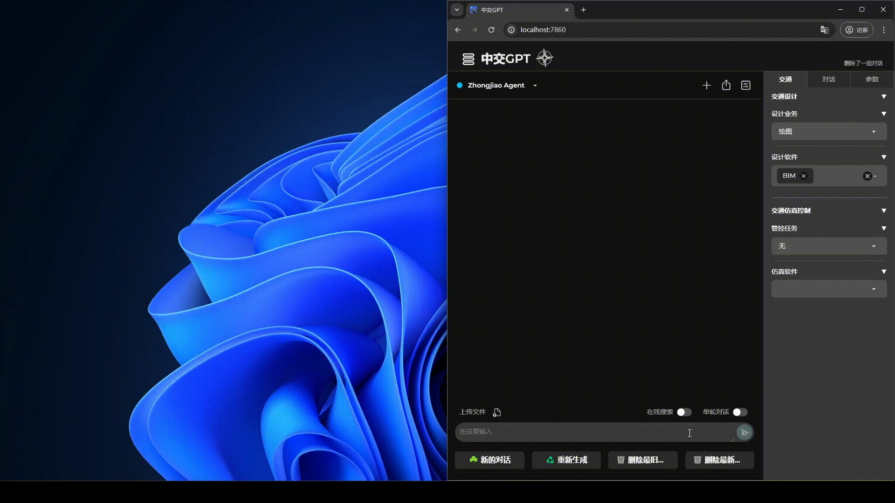

<a href="https://zhongjiaogpt/docs">

</a>

ZhongjiaoGPT - Integrated Transport Design and Automation Platform
===========================================

ZhongjioaGPT（中交GPT）介绍
------------

道路交通设计
------------

 

标准规范问答
------------

交通流仿真
------------

